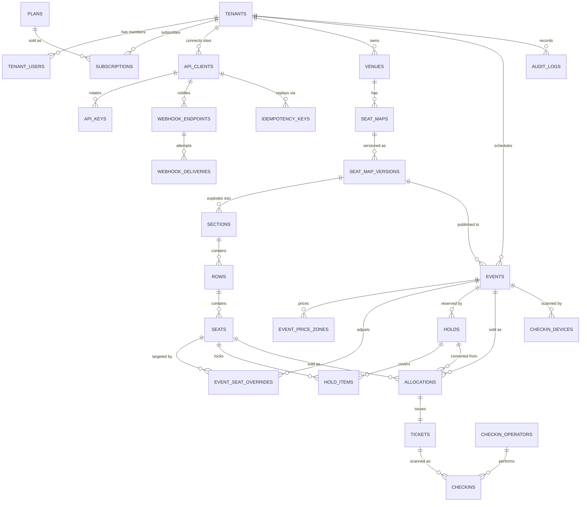
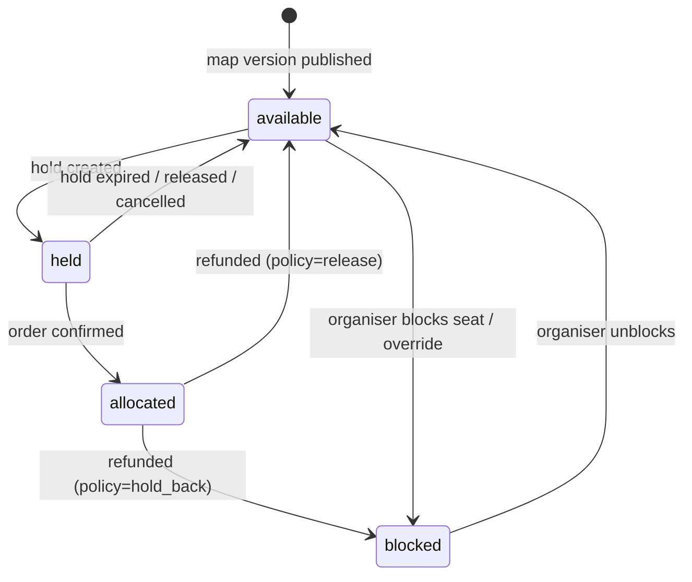
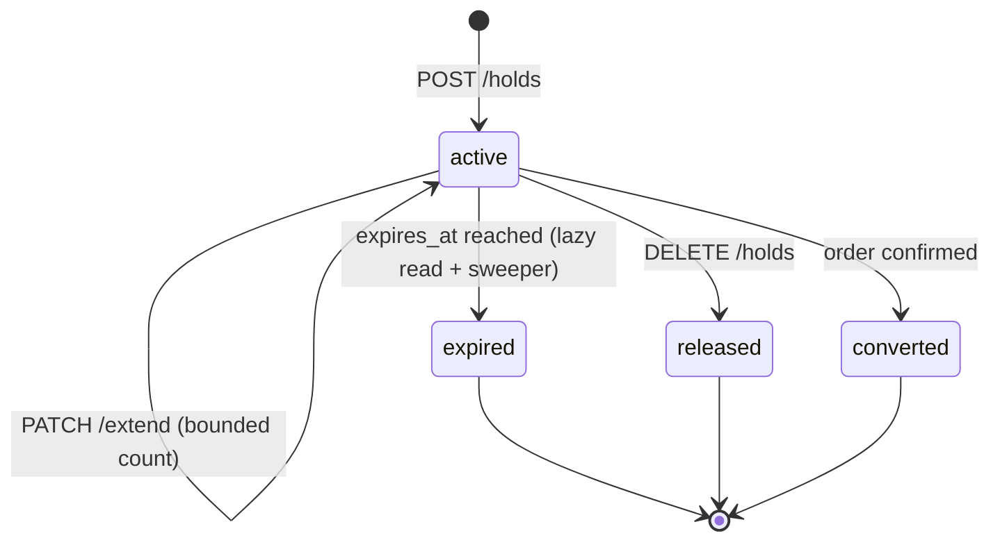
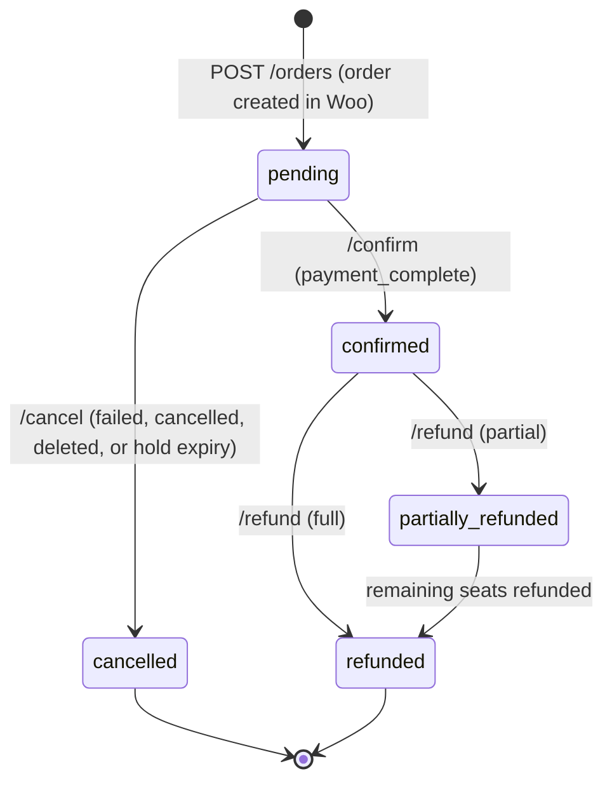
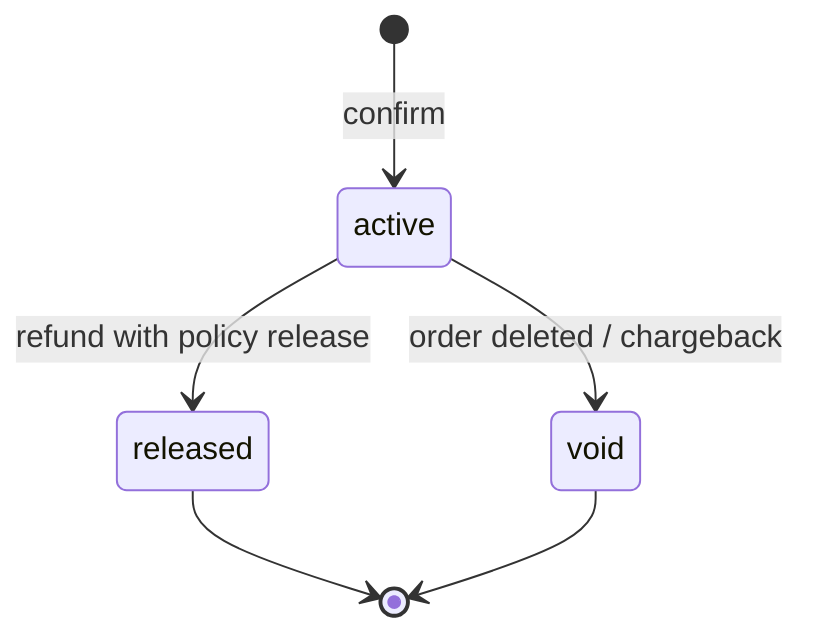
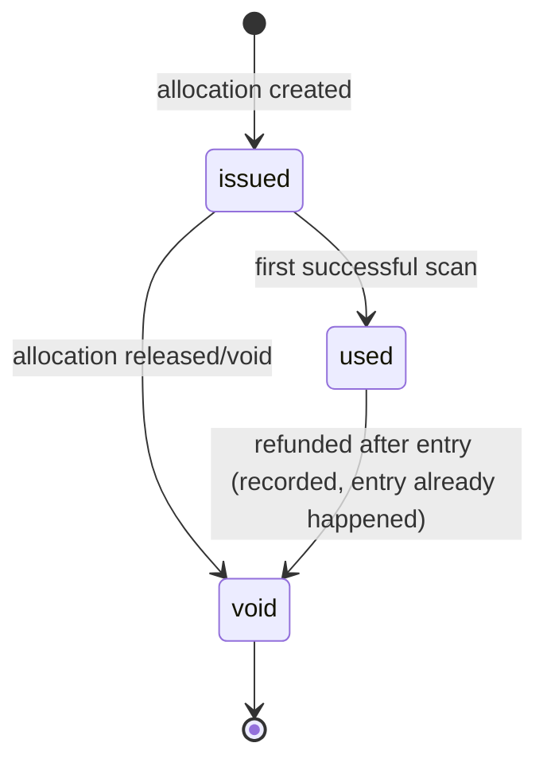
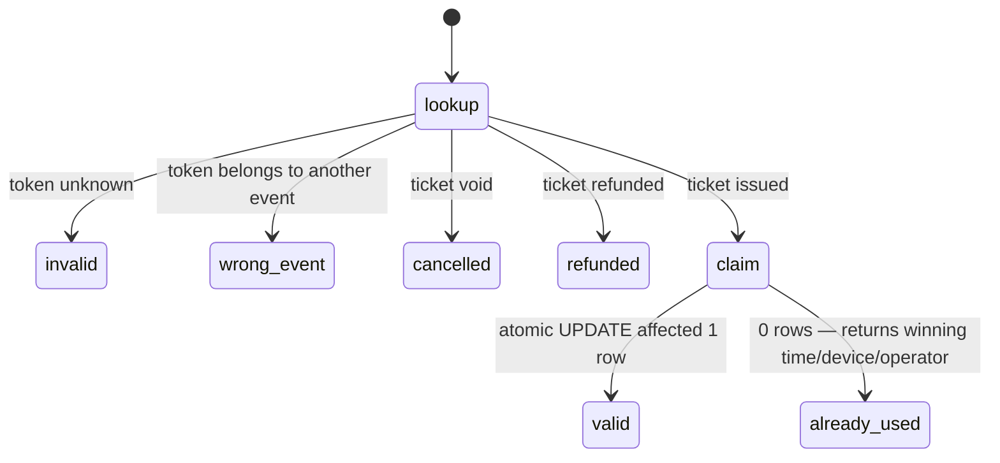

# Data model and state machines

## ERD

## Key invariants

| Invariant | Enforced by |
| --- | --- |
| Every business row belongs to exactly one tenant | `tenant_id` NOT NULL + global scope + `BelongsToTenant` guard on save |
| At most one **active allocation** per (event, seat) | `UNIQUE (event_id, seat_id) WHERE status='active'` |
| At most one **active hold item** per (event, seat) | `UNIQUE (event_id, seat_id) WHERE released_at IS NULL` |
| One allocation per (api_client, external_order, seat) | `UNIQUE (api_client_id, external_order_id, seat_id)` |
| Seat ids are stable and never reused | UUID primary keys; publish copies ids forward by `(section_key,row_key,seat_key)` |
| A published version is immutable | `published_at` set → writes rejected at the model layer; edits create a new draft version |
| Price/currency/version frozen at hold time | `holds.price_snapshot` JSONB + `seat_map_version_id` on the hold |
| Availability is derived, never stored on geometry | `geometry` JSONB has no status field; `SeatAvailability` computes from overrides+holds+allocations |

## State machines

### Seat (per event — derived, not a column)

### Hold

`active` is `released_at IS NULL AND expires_at > now()`. Only `active → converted` produces
allocations; a confirm against an `expired` hold fails with `hold_expired` and the plugin is
expected to surface a re-selection, never to sell anyway.

### External order (SaaS-side mirror of a WooCommerce order)

Every transition is idempotent on `(api_client_id, external_order_id)`; repeating a transition
that already happened returns the same representation with `200`, not an error. A transition that
contradicts the current state (e.g. confirm after refund) returns `409 invalid_transition`.

### Allocation

Only `active` allocations occupy a seat (partial unique index). Released and void rows are kept
for audit and reconciliation.

### Ticket

### Check-in scan

