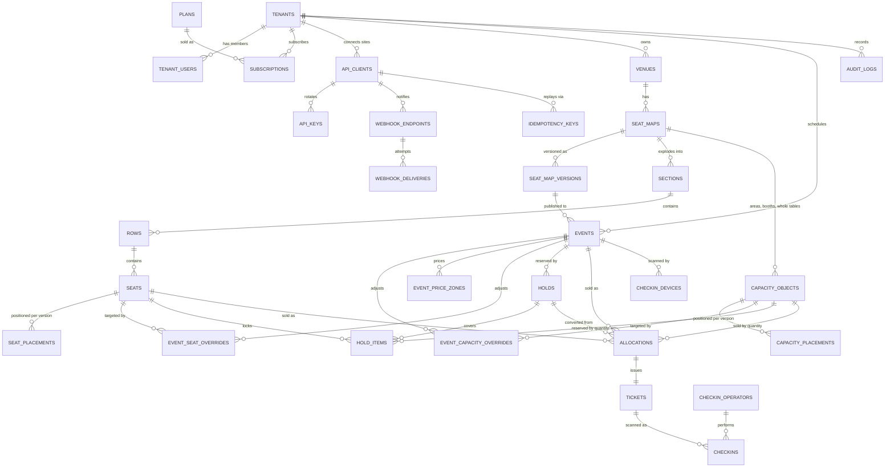
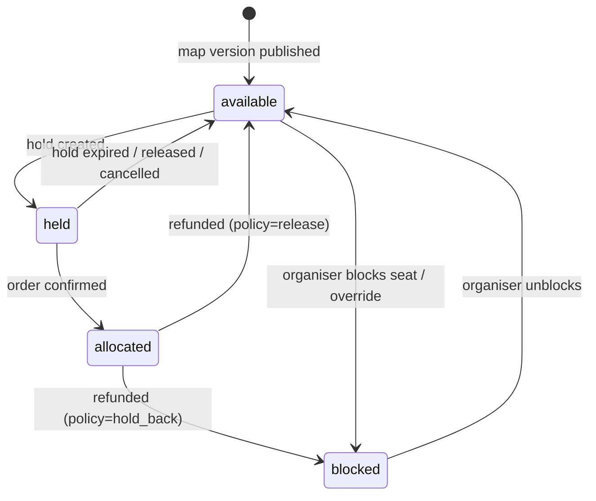
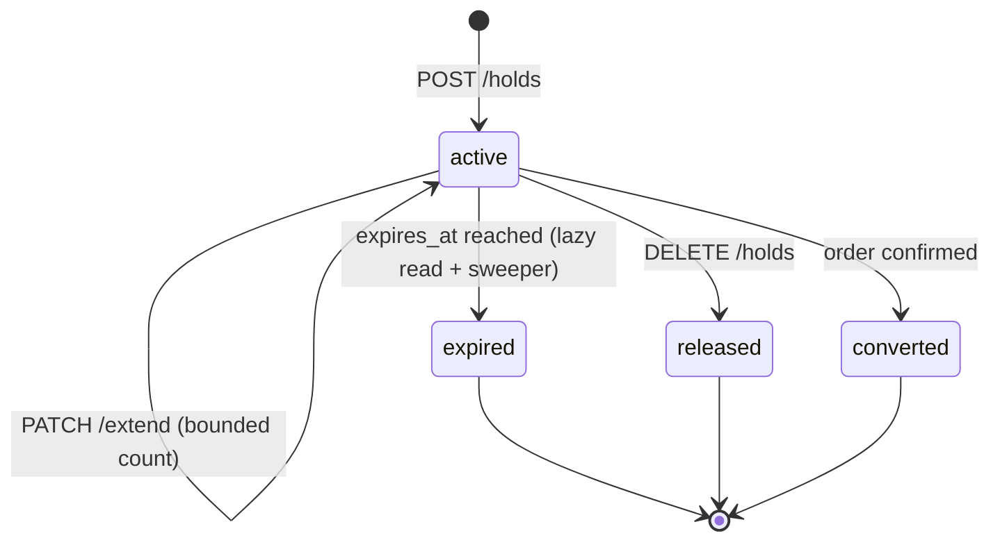
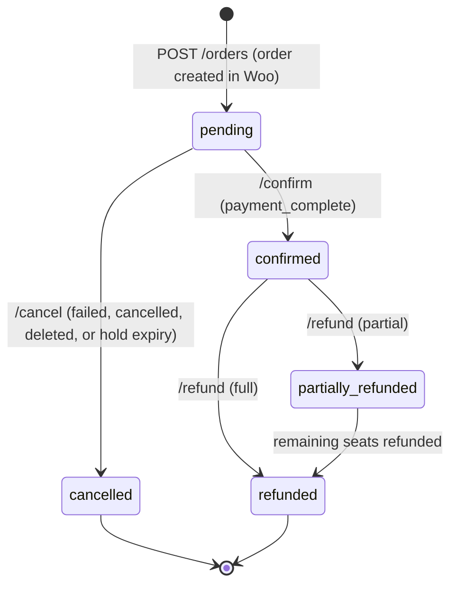
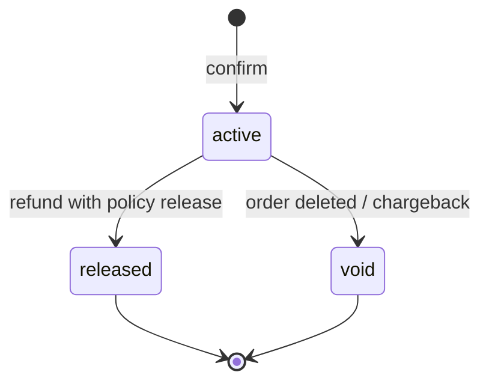
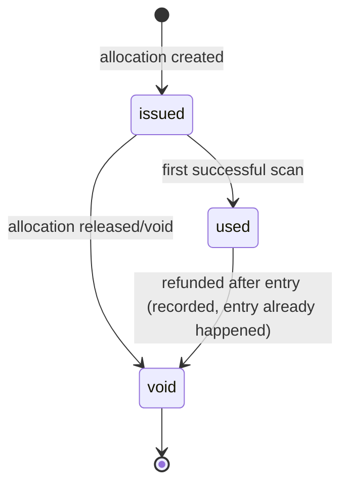
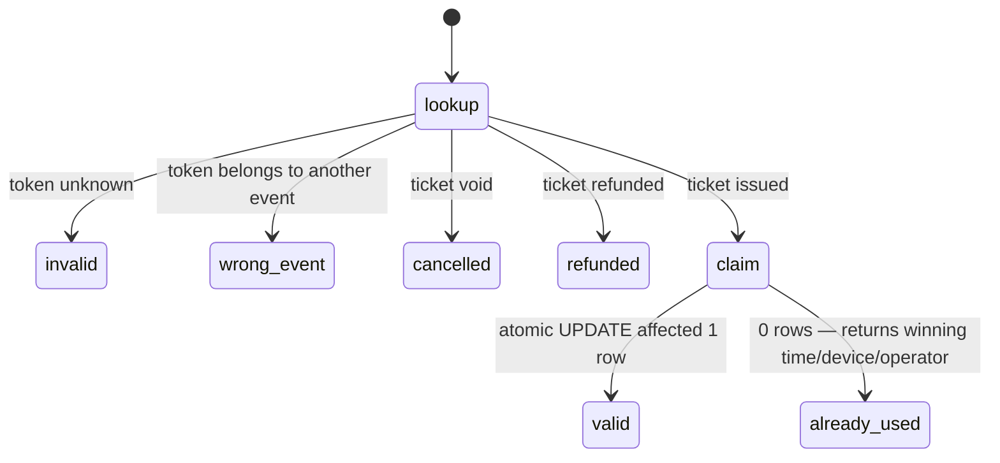

# Data model and state machines

## ERD



## Key invariants

| Invariant | Enforced by |
| --- | --- |
| Every business row belongs to exactly one tenant | `tenant_id` NOT NULL + global scope + `BelongsToTenant` guard on save |
| At most one **active allocation** per (event, seat) | `UNIQUE (event_id, seat_id) WHERE status='active'` |
| At most one **active hold item** per (event, seat) | `UNIQUE (event_id, seat_id) WHERE released_at IS NULL` |
| A hold or allocation is a seat **or** a capacity quantity, never both or neither | `CHECK ((seat_id IS NULL) <> (capacity_object_id IS NULL))` |
| Capacity is never oversold | Transaction-scoped advisory lock on `(event, capacity_object)`, total recomputed under it |
| One allocation per (api_client, external_order, seat) | `UNIQUE (api_client_id, external_order_id, seat_id)` |
| Seat and capacity-object ids are stable and never reused | UUID primary keys; publish carries ids forward by chart key |
| Seat positions are reproducible | Computed from the row's anchor, rotation, curve and spacing by `RowGeometry` (PHP) and `Chart.rowSeatPositions` (JS), pinned to shared golden values |
| A published version is immutable | `published_at` set → writes rejected at the model layer; edits create a new draft version |
| Price/currency/version frozen at hold time | `holds.price_snapshot` JSONB + `seat_map_version_id` on the hold |
| Availability is derived, never stored on geometry | `geometry` JSONB has no status field; `SeatAvailability` computes from overrides+holds+allocations |

## The chart

A chart describes a venue; it says nothing about any event. Geometry is version 2:

```
chart
├── focalPoint          the spot the venue faces — what "best available" sorts towards
├── categories[]        price tiers, with colour and an accessible flag
└── floors[]
    └── objects[]       ordered; the array order is the paint order
        ├── section     a polygon that contains its own rows; you go into it to edit seats
        ├── row         anchor + rotation + curve + seatSpacing + seats[]
        ├── area        general admission or fixed occupancy, sold by quantity
        ├── table       chairs around it, sold by the chair or as a whole
        ├── booth       fixed occupancy, sold whole
        └── shape / text / image / icon    scenery, on one of four layers
```

**A row does not store seat coordinates.** It stores where it starts, how it is turned, how much
it bows and how far apart the chairs sit; positions follow. That is what makes "Number of seats",
"Rotation", "Curve" and "Seat spacing" editable fields rather than read-outs, and it is why the
same maths exists in both PHP and JavaScript with tests pinning them together.

`curve` is the sagitta as a percentage of the row's chord, so the number means the same on a
six-seat row and a sixty-seat one. Seats are spread evenly *along the arc*: spacing them by equal
angle would fan the ends apart.

**Keys are identity; labels are presentation.** Renumbering a row, renaming a section or mirroring
half an auditorium changes what is printed and never what a sold ticket points at.

### Two inventory models

| | Named seat | Capacity object |
| --- | --- | --- |
| What the buyer picks | a specific chair | a quantity |
| Exclusivity from | partial unique index on `(event_id, seat_id)` | a sum against a limit |
| Enforced by | the database rejecting the second insert | advisory lock on `(event, object)`, total recomputed under it |
| A refund | releases the allocation, optionally blocks the seat | releases the allocation; there is nothing to block |

Capacity rows carry a NULL `seat_id`, and Postgres treats NULLs as distinct, so the seat indexes
ignore them and many standing holds for one area coexist — which is exactly right.

## State machines

### Seat (per event — derived, not a column)



### Hold



`active` is `released_at IS NULL AND expires_at > now()`. Only `active → converted` produces
allocations; a confirm against an `expired` hold fails with `hold_expired` and the plugin is
expected to surface a re-selection, never to sell anyway.

### External order (SaaS-side mirror of a WooCommerce order)



Every transition is idempotent on `(api_client_id, external_order_id)`; repeating a transition
that already happened returns the same representation with `200`, not an error. A transition that
contradicts the current state (e.g. confirm after refund) returns `409 invalid_transition`.

### Allocation



Only `active` allocations occupy a seat (partial unique index). Released and void rows are kept
for audit and reconciliation.

### Ticket



### Check-in scan


